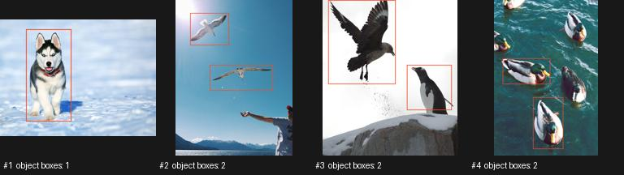

# SOLO benchmark — 20260927T154429Z-benchmark-1fa03f

Status: **complete**

Git commit: `8da9b445698b87e9c575f69f3609941f6dbb373b` (dirty: False)
Command: `./solo benchmark /Users/choejihu/Documents/ChatGPT/SOLO/data/local-smoke --config configs/cpu-smoke.toml`

GPU: CPU only; CUDA runtime: None
CPU: arm (14 physical / None logical / 14 effective cores)
RAM: 48.0 GiB
Python: 3.11.13 (main, Oct  7 2025, 16:08:14) [Clang 20.1.4 ]
PyTorch: 2.7.1

DINO: {'model': 'dino_vits16', 'resolution': 384, 'device': 'cpu', 'mixed_precision': True}
MaskCut: {'tau': 0.15, 'epsilon': 1e-05, 'max_objects': 2, 'min_mask_area': 0.01, 'max_mask_iou': 0.5, 'crf': False}
Box filters: {'min_box_area': 0.005, 'max_box_area': 0.95, 'max_aspect_ratio': 10.0, 'duplicate_iou': 0.9}

Tested worker counts: [1, 2]
Tested batch sizes: [1, 2]
Best parallel config: workers=2, batch=1

Best stable scaling throughput: 5.9432626431906375 img/s
Average sustained throughput: 5.95 img/s
Estimated ImageNet total: 59.77 hours
24h target: **FAIL**

Major bottleneck: DINO / transfers

| Stage | Workers | Batch | Images | Time | img/s | Status |
|---|---:|---:|---:|---|---:|---|
| smoke | 1 | 1 | 4 | 00:00:00 | 5.92 | ok |
| scaling | 1 | 1 | 4 | 00:00:00 | 5.94 | ok |
| scaling | 1 | 1 | 4 | 00:00:00 | 5.97 | ok |
| scaling | 2 | 1 | 4 | 00:00:00 | 5.95 | ok |
| scaling | 2 | 1 | 4 | 00:00:00 | 5.94 | ok |
| scaling | 1 | 2 | 4 | 00:00:00 | 4.81 | ok |
| scaling | 1 | 2 | 4 | 00:00:00 | 4.83 | ok |
| scaling | 2 | 2 | 4 | 00:00:00 | 4.99 | ok |
| scaling | 2 | 2 | 4 | 00:00:00 | 5.00 | ok |
| confirmation | 2 | 1 | 4 | 00:00:00 | 5.95 | ok |

Quality statistics (last confirmation / generation run):

```json
{
  "valid_images": 4,
  "total_boxes": 7,
  "mean_boxes_per_image": 1.75,
  "median_boxes_per_image": 2.0,
  "zero_box_image_ratio": 0.0,
  "boxes_per_image_counts": {
    "1": 1,
    "2": 3
  },
  "bbox_area_distribution": {
    "bin_edges": [
      0.0,
      0.005,
      0.01,
      0.05,
      0.1,
      0.25,
      0.5,
      0.75,
      1.000001
    ],
    "counts": [
      0,
      0,
      0,
      5,
      1,
      1,
      0,
      0
    ]
  },
  "bbox_aspect_ratio_distribution": {
    "units": "width/height in original image pixels",
    "bin_edges": [
      0.0,
      0.1,
      0.25,
      0.5,
      1.0,
      2.0,
      4.0,
      10.0,
      1000000.0
    ],
    "counts": [
      0,
      0,
      1,
      3,
      2,
      1,
      0,
      0
    ]
  }
}
```

Preview samples: 4



Measurement details:

End-to-end timed wall includes decode, DINO + host/device transfers, queue/IPC, CPU MaskCut, bbox conversion, atomic label/receipt writes and final worker drain. Pool startup, kernel warmup, discovery and resume scanning are separately recorded. Stage ms/image are summed service times across workers and overlap; do not add them as wall time. Filesystem cache is not flushed between candidates.

Warnings/errors:

- CPU correctness run: this is not an A5000 throughput result.
- Reduced confirmation: <10k images or <2 repeats; full generation requires the default server benchmark.
