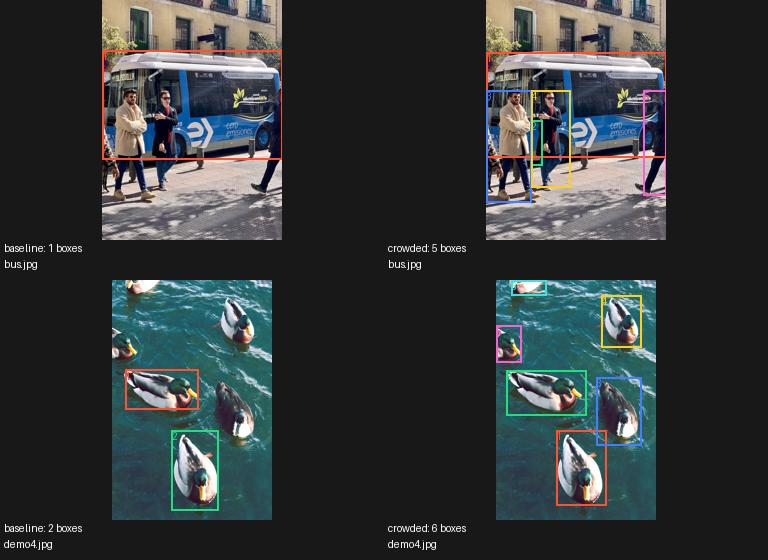

# SOLO compare — 20261001T120540Z-compare-dedede

Status: **complete**

Git commit: `10e6481d77c30c76d8e3390db447038c43a6362d` (dirty: False)
Command: `./solo compare data/crowded-check --limit 2`

GPU: CPU only; CUDA runtime: None
CPU: arm (14 physical / 14 logical / 14 effective cores)
RAM: 48.0 GiB
Python: 3.11.13 (main, Oct  7 2025, 16:08:14) [Clang 20.1.4 ]
PyTorch: 2.7.1

DINO: {'model': 'dino_vits16', 'resolution': 512, 'device': 'auto', 'mixed_precision': True}
MaskCut: {'tau': 0.15, 'epsilon': 1e-05, 'max_objects': 12, 'min_mask_area': 0.003, 'max_mask_iou': 0.5, 'crf': False, 'all_components': True, 'split_depth': 0, 'split_min_patches': 8, 'split_temperature': 0.05, 'split_max_ncut': 0.15, 'split_min_cosine_distance': 0.1, 'max_instances': 24}
Box filters: {'min_box_area': 0.002, 'max_box_area': 0.95, 'max_aspect_ratio': 10.0, 'duplicate_iou': 0.9}
Dataset source: external or not recorded

Tested worker counts: [4]
Tested batch sizes: [1]
Best parallel config: n/a

Best stable scaling throughput: n/a img/s
Average sustained throughput: 0.00 img/s
Estimated current dataset (n/a images): n/a
Current dataset 24h target: **NOT MEASURED**
Estimated ImageNet total: n/a
Full ImageNet 24h target: **NOT MEASURED**

Major bottleneck: not measured

| Stage | Workers | Batch | Images | Time | img/s | Status |
|---|---:|---:|---:|---|---:|---|
| baseline | 4 | 1 | 2 | 00:00:00 | 4.70 | ok |
| crowded | 4 | 1 | 2 | 00:00:00 | 2.38 | ok |

Quality statistics (last confirmation / generation run):

```json
{
  "baseline": {
    "valid_images": 2,
    "total_boxes": 3,
    "mean_boxes_per_image": 1.5,
    "median_boxes_per_image": 1.5,
    "zero_box_image_ratio": 0.0,
    "boxes_per_image_counts": {
      "1": 1,
      "2": 1
    },
    "bbox_area_distribution": {
      "bin_edges": [
        0.0,
        0.005,
        0.01,
        0.05,
        0.1,
        0.25,
        0.5,
        0.75,
        1.000001
      ],
      "counts": [
        0,
        0,
        0,
        2,
        0,
        1,
        0,
        0
      ]
    },
    "bbox_aspect_ratio_distribution": {
      "units": "width/height in original image pixels",
      "bin_edges": [
        0.0,
        0.1,
        0.25,
        0.5,
        1.0,
        2.0,
        4.0,
        10.0,
        1000000.0
      ],
      "counts": [
        0,
        0,
        0,
        1,
        2,
        0,
        0,
        0
      ]
    }
  },
  "crowded": {
    "valid_images": 2,
    "total_boxes": 11,
    "mean_boxes_per_image": 5.5,
    "median_boxes_per_image": 5.5,
    "zero_box_image_ratio": 0.0,
    "boxes_per_image_counts": {
      "5": 1,
      "6": 1
    },
    "bbox_area_distribution": {
      "bin_edges": [
        0.0,
        0.005,
        0.01,
        0.05,
        0.1,
        0.25,
        0.5,
        0.75,
        1.000001
      ],
      "counts": [
        0,
        0,
        3,
        6,
        1,
        1,
        0,
        0
      ]
    },
    "bbox_aspect_ratio_distribution": {
      "units": "width/height in original image pixels",
      "bin_edges": [
        0.0,
        0.1,
        0.25,
        0.5,
        1.0,
        2.0,
        4.0,
        10.0,
        1000000.0
      ],
      "counts": [
        0,
        1,
        3,
        4,
        2,
        1,
        0,
        0
      ]
    }
  }
}
```

Preview samples: 0



Measurement details:

End-to-end timed wall includes decode, DINO + host/device transfers, queue/IPC, CPU MaskCut, bbox conversion, atomic label/receipt writes and final worker drain. Pool startup, kernel warmup, discovery and resume scanning are separately recorded. Stage ms/image are summed service times across workers and overlap; do not add them as wall time. Filesystem cache is not flushed between candidates.

Warnings/errors:

- Experimental splitting may divide one object into parts. More boxes is not proof of better instance recall. Visually check missed objects, merged people, body fragments, and background boxes. This small batch-1 run does NOT qualify full generation.

## Visual sanity check scope

Two public/bundled sample images, CPU only. This is not a crowded-person
accuracy benchmark and does not qualify a full generation run. No COCO
annotations or semantic class labels were used.

| Sample | Baseline boxes | Crowded boxes | Visual observation |
|---|---:|---:|---|
| bus.jpg | 1 | 5 | Separate person boxes appear alongside the bus; overlap remains. |
| demo4.jpg | 2 | 6 | More separate ducks, including partially visible ones, receive boxes. |

More boxes alone does not establish correct instances. The original user
failure images were unavailable. Optional recursive splitting is disabled;
merged objects and body-part false positives are not ruled out. Input
provenance and SHA256 checksums are in [provenance.json](provenance.json).
