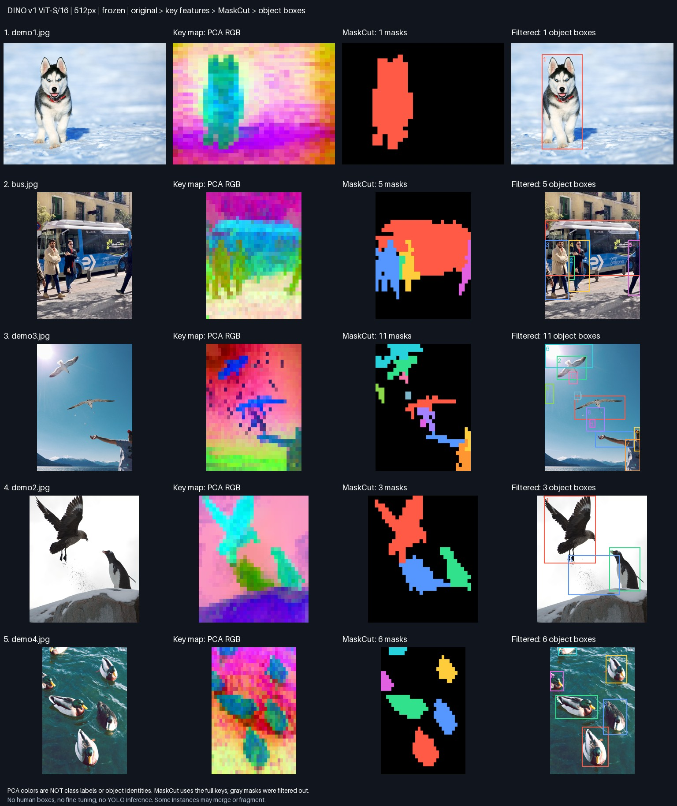

# DINO key pipeline visualization

Status: complete
Source: {'commit_sha': '9c2e2fafc9782973eac8d38adbc12fb75b6c20d6', 'branch': 'codex/milestone-1', 'dirty': False}
Command: `./solo key-preview data/key-samples --crowded`

- DINO v1 ViT-S/16, frozen. Last-block key projection, excluding CLS.
- PCA RGB shows only three components of normalized 384D keys. Colors are per-image, not classes, object IDs, attention weights, or probabilities.
- MaskCut consumes all 384 key channels, NOT the PCA RGB image.
- Mask colors match retained box IDs; gray masks were filtered out. Different images may reuse colors. Boxes are class 0 = object, not YOLO predictions.
- Square-resized model input maps back to original coordinates; no crop DINO calls.
- Qualitative examples only; no instance ground truth or recognition accuracy measured.

## Observed successes and failures

- Dog: 1 box, visually follows the foreground animal.
- Bus scene: 5 boxes, including separate people; a small overlapping region is questionable.
- Birds/person scene: 11 boxes, clear over-segmentation and background/body-part false positives.
- Eagle/penguin scene: 3 boxes; an extra region between the birds is not a separate animal.
- Ducks: 6 boxes, including partially visible ducks.

These examples do not establish crowd instance accuracy or identity recognition.
PCA color separation is not proof of separate objects. The failed examples are
retained intentionally. No YOLO model was used to produce these boxes.

Input provenance: [provenance.json](provenance.json). Full keys were extracted
once per image using the existing pretrained DINO v1 ViT-S/16 checkpoint.

## Model decision

Keep v1 as the current reproducible key/MaskCut baseline. Do not conclude it is
sufficient for final crowded-scene personalization from these samples. DINOv2
has stronger general-purpose/domain-transfer features; DINOv3 emphasizes dense
feature quality and is the first candidate to evaluate for future ROI matching.
Neither claim substitutes for a controlled instance-proposal test in SOLO. No
v2/v3 weights were run in this experiment.

Sources: [DINOv2](https://github.com/facebookresearch/dinov2),
[DINOv3](https://ai.meta.com/research/publications/dinov3/).
