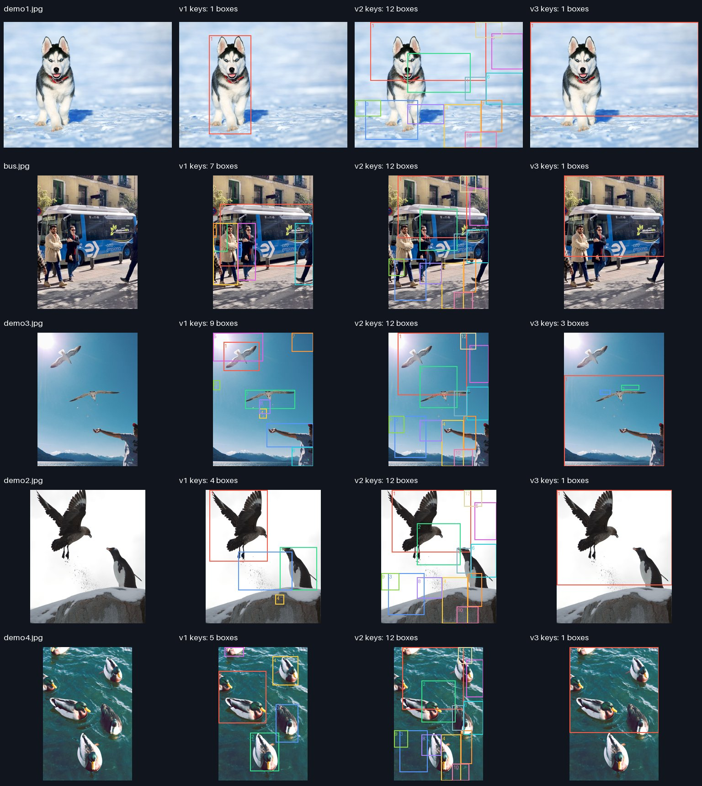
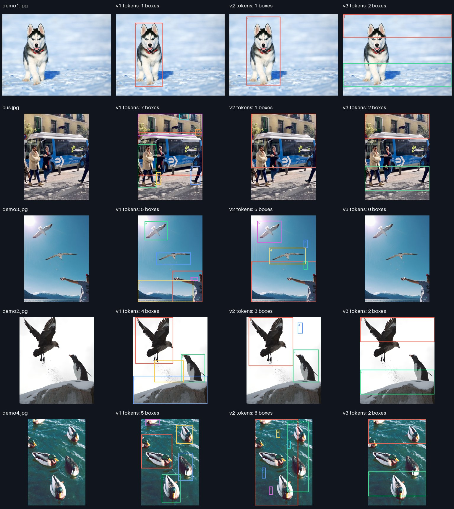
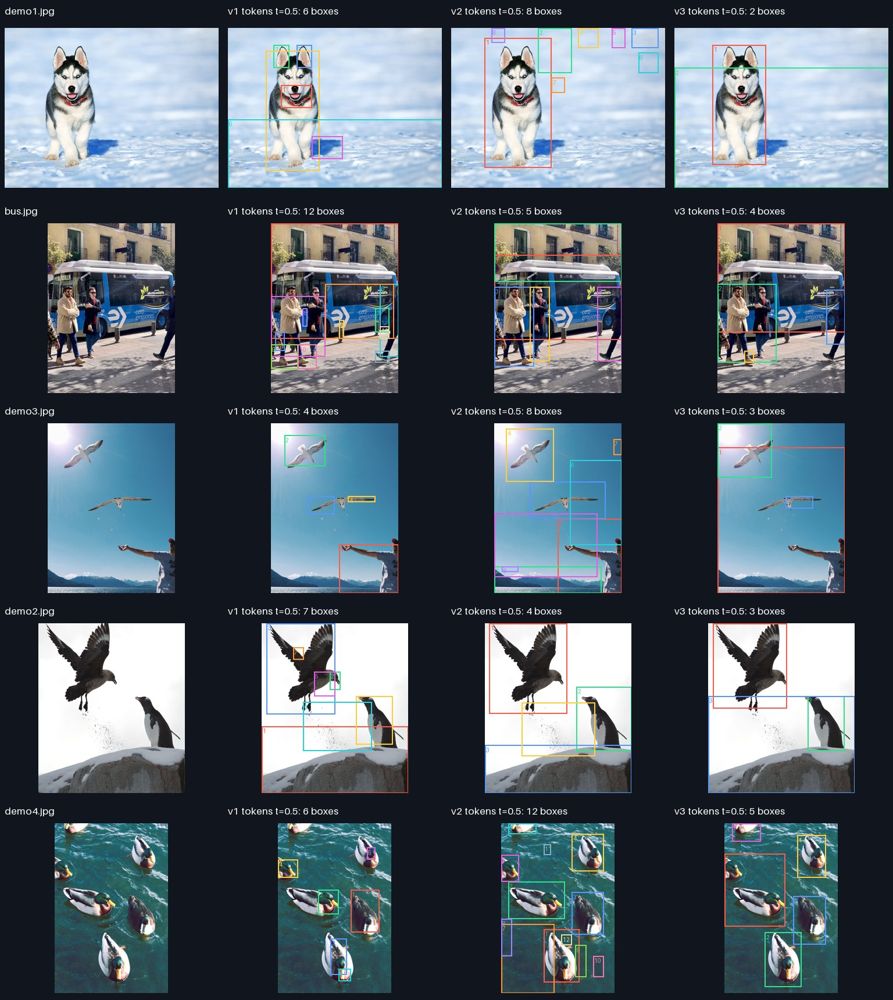
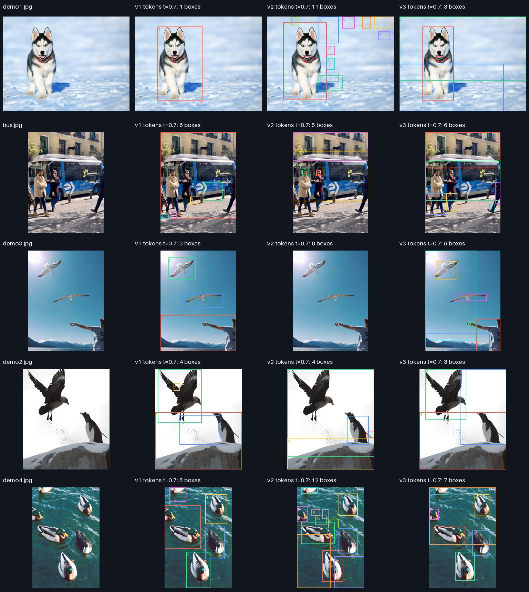
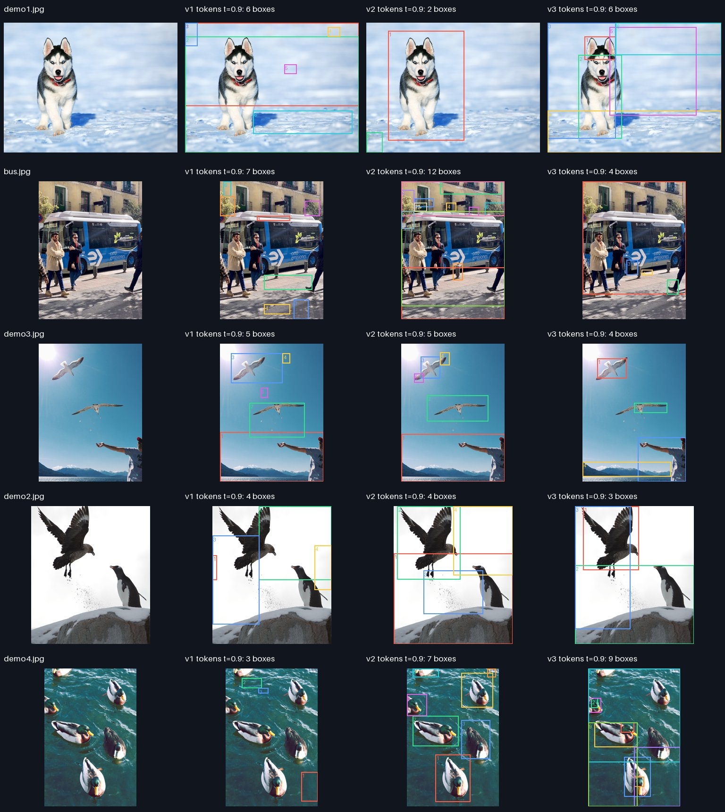

# DINO backbone comparison

Status: complete
Git: {'commit_sha': 'd40624462baccf35531a2d721286e2e19702e005', 'branch': 'codex/milestone-1', 'dirty': False}
Command: `./solo compare-backbones data/key-samples`

- Same images, 448x448 LANCZOS, ImageNet normalization, CPU FP32, 1 thread, batch 1. ViT-S models (~22M parameters), explicit non-fused attention, one warmup per model.
- v1/v3: 28x28 grid (patch16). v2: 32x32 (patch14). Resolution is matched, token count is not.
- Two feature probes: raw last-block QKV keys (v3 pre-RoPE) and final LayerNorm patch tokens. CLS/register tokens excluded. Both extracted in ONE full forward per image.
- MaskCut/filter configuration fixed for all models/features. Tau was not tuned per model. This is a transfer sanity check, NOT a ranking of optimally tuned backbone performance.
- Median per-image timings across repeated identical inputs, then mean over images. Startup/download/PCA/rendering excluded. Common decode/forward plus each feature's MaskCut/box/write time describes serial latency, NOT GPU or batched throughput.
- No ground truth, no mAP or objective accuracy. Box count is not instance correctness. PCA colors have no class/identity meaning and are fitted separately for each image/model.
- v1 uses the project's original implementation; v2/v3 use pinned timm conversions. The v3 timm RoPE implementation has documented numerical differences from Meta's.
- Secondary diagnostic: final patch tokens at fixed tau values 0.5, 0.7, 0.9, identical for all models. Reuses extracted features; no retraining or extra forward. These five examples are not an independent validation set for threshold selection.

| Model | Forward ms | Keys cut/box/write ms | Tokens cut/box/write ms |
|---|---:|---:|---:|
| v1 | 212.7 | 71.1 | 81.1 |
| v2 | 329.9 | 67.9 | 146.0 |
| v3 | 216.4 | 54.9 | 54.2 |

## Raw key probe

## Final patch-token probe

## Fixed token threshold 0.5

## Fixed token threshold 0.7

## Fixed token threshold 0.9

[Qualitative observations and decision](review.md)
