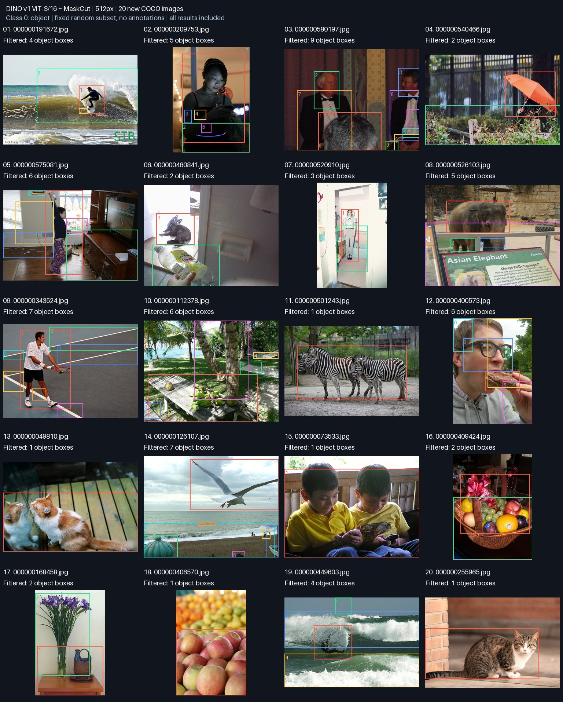

# DINO v1: 20 additional COCO examples

Frozen DINO v1 ViT-S/16 keys → MaskCut → class 0 object boxes. Resolution 512,
`configs/crowded.toml`, no CRF, no recursive splitting. No model or threshold changes
were made for these images. No COCO annotations, fine-tuning, or YOLO predictions.



## Selection and reproduction

20 of the 5,000 official COCO val2017 JPEGs were selected before viewing any results:
sort archive member names by SHA256(`solo-v1-more-20261001:<member-name>`) and take
the first 20. `provenance.json` records the source archive URL/ETag, filenames, and
each original image's SHA256. Only the selected image members were downloaded
using HTTP ranges (12.4 MB transferred); the original images remain in ignored
`data/coco-visual-20`. The preview then applies the project's deterministic seed-0
ordering, recorded in `features.json`. All 20 results are included without selection
by quality. These are different from the previous four CutLER demos and bus image.

With those image files present, reproduce the full feature/mask/box report:

```bash
./solo key-preview data/coco-visual-20 --crowded --limit 20
```

All 20 completed: 75 retained boxes, mean 3.75 boxes/image, zero-box ratio 0/20.
Box count is not an accuracy measurement. There are no scored ground-truth boxes.
Per-image settings, source commit, timings, and checkpoint identity are in
`features.json`. This CPU visualization run includes PCA/rendering and is not a
production throughput benchmark.

## Visual observations

- #20: the single cat is largely enclosed. #1 and #9: the main person is enclosed,
  but extra wave/court/background boxes remain.
- #11: multiple zebras merge into one box. #15: two children merge into one box.
  #18: multiple apples merge into one region. The instance separation problem remains.
- #3 and #12: heads/body parts form separate or overlapping boxes; #8 separates
  elephant body and legs and also includes sign/background regions.
- #13 contains a cat and its mirror reflection in one box. This is not evidence of
  two real cats being missed, but shows that the method groups similar appearance.
- This larger uncurated sample does not justify claiming that v1 solves crowded
  object discovery. It supports keeping v1 as the current baseline while recording
  merged instances, object fragments, and background false positives explicitly.

[First five examples: original → key PCA → masks → boxes](detail_5.jpg).
[All twenty detailed examples](key_pipeline.jpg).
Individual full-width rows are `sample-01.jpg` through `sample-20.jpg`.
PCA colors and numbered boxes are not semantic class labels or persistent identities.
