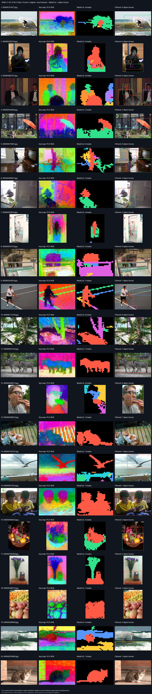

# DINO key pipeline visualization

[20-image box overview](boxes_20.jpg) · [First five detailed examples](detail_5.jpg)
· [Selection, reproduction, and failure analysis](review.md)

Status: complete
Source: {'commit_sha': '92f1f159bd0a7978795a1f5ce6075cd20d77645f', 'branch': 'codex/milestone-1', 'dirty': False}
Command: `./solo key-preview data/coco-visual-20 --crowded --limit 20`

- DINO v1 ViT-S/16, frozen. Last-block key projection, excluding CLS.
- PCA RGB shows only three components of normalized 384D keys. Colors are per-image, not classes, object IDs, attention weights, or probabilities.
- MaskCut consumes all 384 key channels, NOT the PCA RGB image.
- Mask colors match retained box IDs; gray masks were filtered out. Different images may reuse colors. Boxes are class 0 = object, not YOLO predictions.
- Square-resized model input maps back to original coordinates; no crop DINO calls.
- Qualitative examples only; no instance ground truth or recognition accuracy measured.

