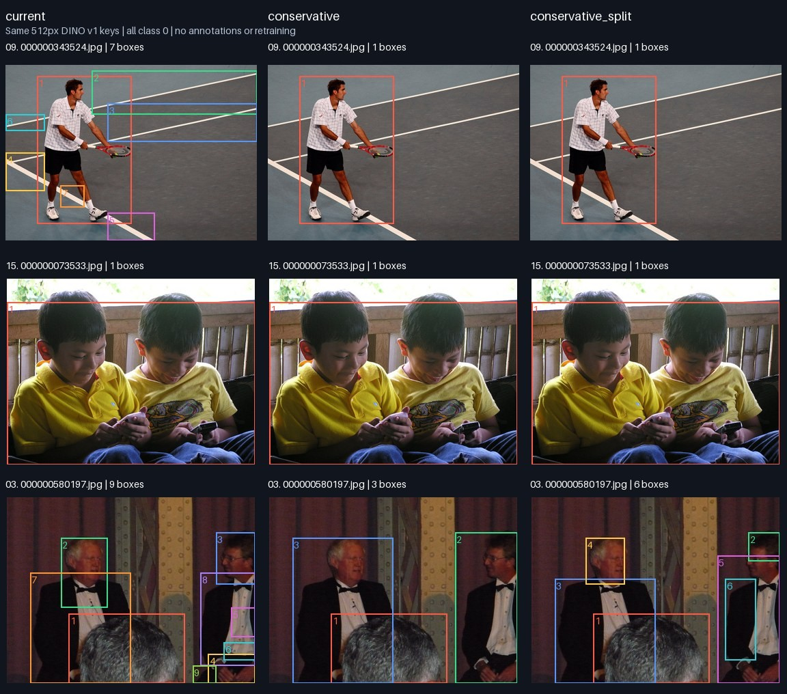

# Instance separation ablation — not solved by these settings

Same 20 uncurated COCO val2017 images and same frozen DINO v1 ViT-S/16 keys at
512px as the previous report. One DINO call per image, shared by all three variants.
No annotations, additional weights, dependency changes, or training labels written.
Source code: `92973c5`; exact source identity, hardware, checkpoint, settings, box
coordinates and stage timings are in `ablation.json`. Input hashes and selection
procedure are in `provenance.json`.

| Setting | Change from crowded | Total boxes / 20 | Mean boxes/image |
|---|---|---:|---:|
| current | unchanged | 75 | 3.75 |
| conservative | 3 extraction rounds; seed component only; mask/box minimum area 1% | 38 | 1.90 |
| conservative_split | conservative + split depth 2; minimum 12 patches per child | 43 | 2.15 |

All other settings remain equal, including tau=0.15, duplicate IoU=0.9, and resolution.
All runs completed and all images have at least one box. These are proposal counts,
not accuracy or precision/recall. This is a combined settings ablation, so a change
cannot be causally attributed to any single parameter. CPU service times are not
production throughput estimates. The sample has already been visually inspected;
any future algorithm needs a separate holdout before promotion.

## Observed tradeoffs

- #9 tennis player: conservative removes the six extra boxes and keeps a largely
  complete person box. #1 and #14 also lose small spurious regions, but background
  wave/beach boxes remain.
- #11 zebras, #15 children, #18 apples: merged instances remain merged under all
  three settings. Lowering proposal count does not restore individual instances.
- #3: conservative retains larger person regions; extra splitting separates heads
  and clothing into parts. #8: extra splitting subdivides the elephant's head/body.
- #5: conservative loses the largely complete person proposal and retains coarse
  background/partial-person regions. Thus even apparent box cleanup can reduce recall.
- #12: the face/food remain partial regions instead of a complete person box.

**Decision:** do not promote either candidate to production or describe these as
an instance-separation fix. Existing baseline/crowded settings, pseudo-labels,
checkpoints, and resume state are unchanged. More boxes, fewer boxes, and stronger
recursive cuts each fail to establish the intended per-instance objectness quality.

The figure deliberately selects #9, #15, #3 to illustrate cleanup, unresolved
merging, and fragmentation; it is not a success-only sample or a scored evaluation.
Full results, including all failures: [1–5](comparison-1.jpg),
[6–10](comparison-2.jpg), [11–15](comparison-3.jpg), [16–20](comparison-4.jpg).

## Next method to investigate

The current graph relies on DINO appearance similarity and patch connectivity.
Neighboring similar objects can form one component; appearance differences within
one object can instead form multiple components. Box NMS can suppress overlapping
proposals, but cannot create two instance boxes from a single merged proposal.

Retaining a self-supervised discovery objective calls for testing additional
boundary/spatial evidence. [CutS3D (ICCV 2025)](https://leonsick.github.io/cuts3d/)
specifically studies overlapping instances and combines depth with semantic masks;
it is a research candidate, not integrated or benchmarked here. Its choice of depth
checkpoint and supervision must be audited before adoption under our constraints.

If externally supervised segmentation pretraining is acceptable, an alternative is
automatic masks from [SAM 2](https://github.com/facebookresearch/sam2), followed by
quality/stability/duplicate filtering and DINO matching. SAM's supervised pretraining
changes the original strict unsupervised premise even when no target COCO annotations
are used. It also needs separate speed and instance-quality validation and does not
guarantee correct object granularity. No such model has been installed in this run.

## Reproduction

`experiment.py` is the exact executed experiment source (originally launched from
ignored `work/tmp/diagnose_instances.py`). Run it from repository root with the same
project-local uv environment/cache/thread variables as the `solo` wrapper after
restoring the twenty image files listed in `provenance.json`. It creates a new
timestamped report and never changes production labels. `make_focus.py` produces
the selected diagnostic figure from the four complete comparison images.
