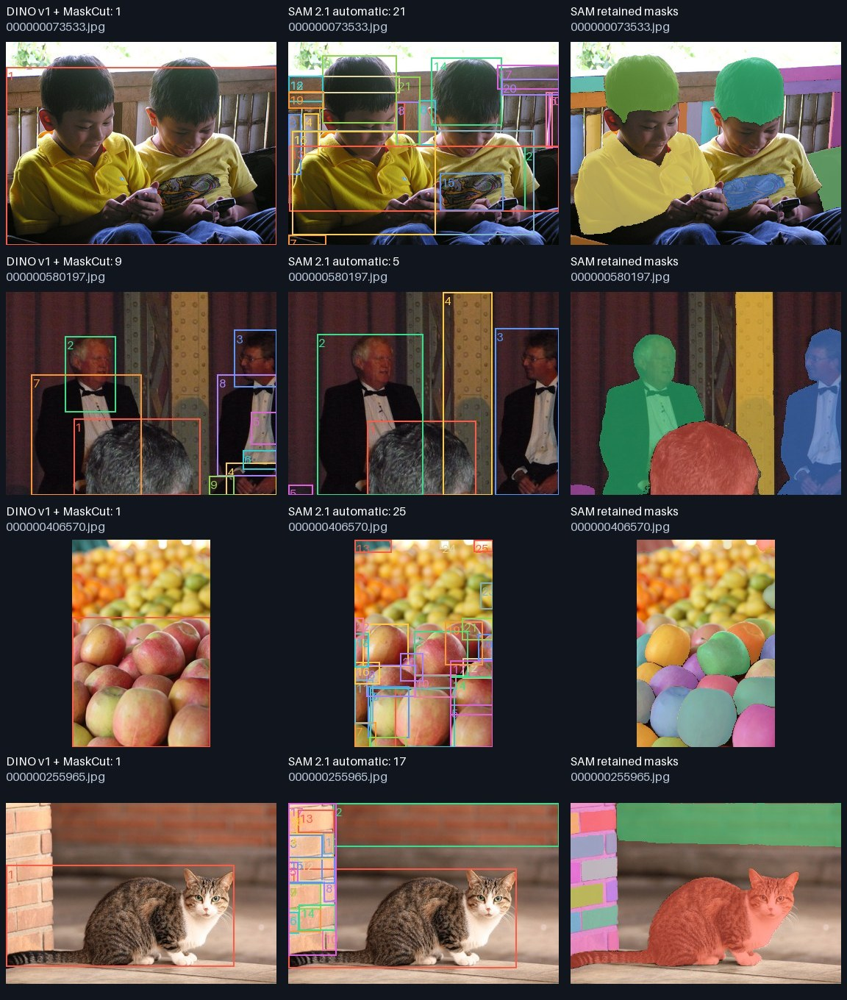

# What the SAM comparison establishes

Follow-up: [32×32 automatic-point confirmation on five diagnostic images](../20261001T123801Z-sam-comparison-4c2d5f/review.md).
Denser sampling did not produce complete person/individual zebra proposals in
these cases; the children still have 21 part/background proposals.

Same twenty COCO val2017 images as the DINO-only run, original hashes and selection
in `provenance.json`. No target annotations, manual clicks/boxes, fine-tuning or
training-label changes. Source commit `268c045`; all 20 images completed. Full
settings, per-image boxes, model hashes and service timings: `comparison.json`.

| Property | DINO v1 + MaskCut | SAM 2.1 Hiera-Tiny + automatic mask generator |
|---|---|---|
| Image encoder | ViT-S/16 | Hiera-Tiny, a hierarchical Vision Transformer |
| Parameters | 21,665,664 | 38,962,498, including video modules unused here |
| Input resolution | 512 × 512 | 1024 × 1024 |
| Pretraining distinction | Self-supervised image features | Model trained with mask supervision |
| Region generation | Normalized cut on attention keys | Uniform automatic point prompts and learned mask decoder |
| Total retained boxes / 20 | 75 | 180 |
| Mean boxes/image | 3.75 | 9.00 |
| Zero-box images | 0 | 2 |
| Mean measured service time/image | 0.348 s | 5.049 s |

CPU FP32, four PyTorch threads, one unmeasured complete warmup and one measured
pass/image. DINO timing includes preprocessing, feature extraction, MaskCut and
boxes. SAM timing includes preprocessing, image encoder, 256 point prompts in
batches of 16, mask decoder, automatic-mask filters and shared geometric filters.
Common file decode is recorded separately. Neither timing includes model loading,
downloads, rendering or report writing. No CUDA/MPS inference. These times are not
an A5000 throughput prediction or an isolated comparison of backbone efficiency.

SAM's fixed settings are `pred_iou_thresh=0.8`, `stability_score_thresh=0.95`,
`box_nms_thresh=0.7`, zero crop layers, no CUDA cleanup, no mask refinement. The
official AMG defaults are described as selected for Hiera-L, not optimized for Tiny.
The 16×16 point grid is a CPU preview adaptation; official default is 32×32.
Both methods use the same final area/aspect/duplicate filter, but SAM also has its
own mask-quality filters and NMS. SAM's predicted mask IoU is not object confidence.
No box count was forced and no manual foreground/part filtering was used.

## Visual findings

- #3, `000000580197`: SAM has largely complete separate regions for the visible
  suited people, whereas DINO also emits heads/body parts. SAM still includes wall
  and foreground fragments.
- #15, `000000073533`: DINO merges both children. SAM creates 21 proposals, including
  heads, shirts and bench slats; it does **not** deliver exactly two complete people.
- #18, `000000406570`: SAM separates many visible apples, whereas DINO groups the
  foreground apples. Some background/partial regions remain. 25 proposals is not a
  count of verified correct apples.
- #20, `000000255965`: SAM delineates the cat well but also generates many brick
  and background regions (17 boxes total). DINO has one mostly complete cat box.
- #1 surfer and #11 zebras have zero retained SAM boxes at this grid/threshold
  setting. DINO contains the surfer but merges zebras. #9 SAM's two boxes are court
  and shorts rather than a whole player. Fewer boxes is not necessarily improvement.
- #5 SAM includes many room regions and misses a complete person proposal.

The four rows (#15, #3, #18, #20) were selected after inspection to demonstrate
failure and benefit, not used as a scored holdout. All twenty results are available
in `comparison-1.jpg` to `comparison-4.jpg` and individual `sample-*.jpg` files.

**Decision:** no replacement of the production DINO/MaskCut pipeline on this
evidence. SAM can provide sharper regions and separate some instances, but raw AMG
regions are not automatically complete foreground objects. A foreground/object
selection strategy and an independently evaluated holdout are still required.
This Tiny/AMG setup cannot establish that SAM generally outperforms or underperforms
DINO, nor establish few-shot recognition accuracy. Larger SAM models, prompts,
different thresholds and crop refinement have not been tested in this report.

ViT describes an architecture; DINO describes self-supervised representation
learning; SAM is a segmentation system. SAM 1 uses a vanilla ViT image encoder.
SAM 2 uses Hiera, which is itself a hierarchical Vision Transformer. Replacing
MaskCut with SAM does not require removing DINO from later few-shot feature matching.
It does change the strict unsupervised-pretraining premise because of SAM's mask
supervision.

Sources: [Hiera paper](https://arxiv.org/abs/2306.00989),
[SAM 2 paper](https://arxiv.org/abs/2408.00714),
[pinned AMG implementation](https://github.com/facebookresearch/sam2/blob/2b90b9f5ceec907a1c18123530e92e794ad901a4/sam2/automatic_mask_generator.py).
