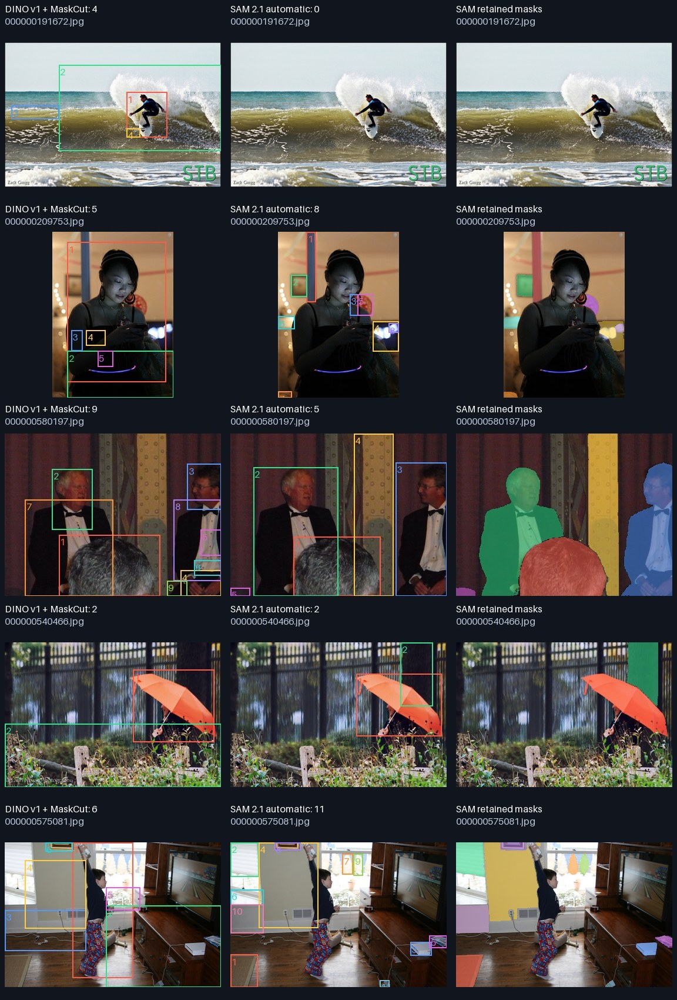
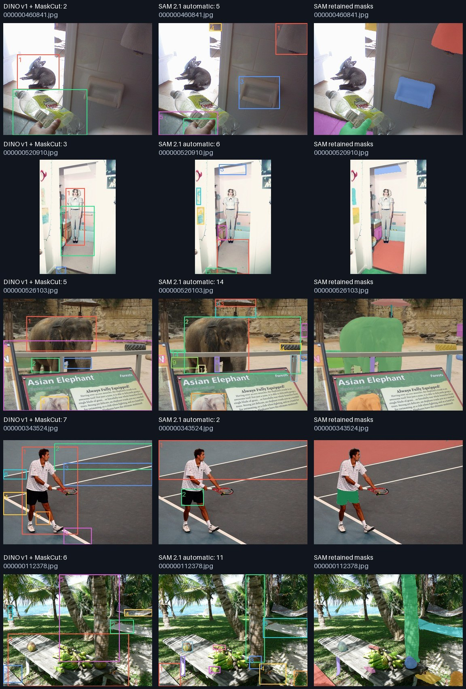
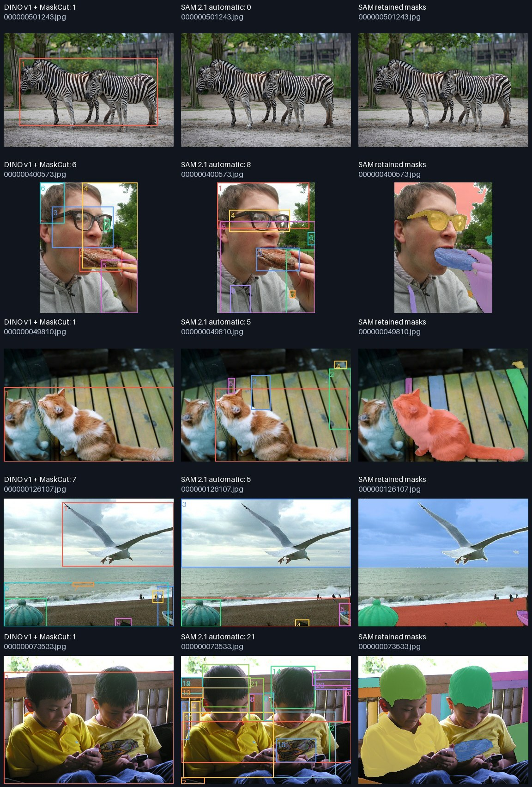
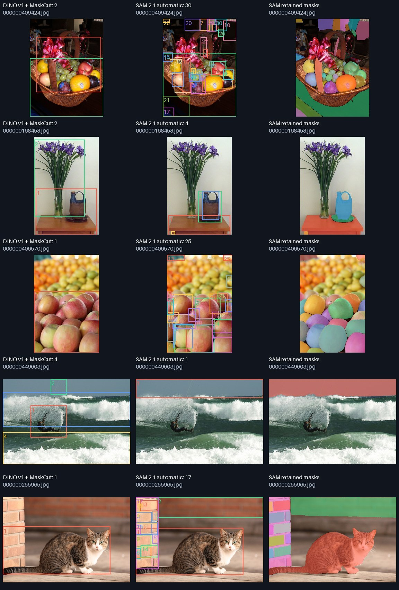

# DINO v1/MaskCut vs SAM 2.1 Hiera-Tiny

[Visual findings and limitations](review.md) · [Selected diagnostic examples](focus.jpg)

Status: complete; images completed: 20/20
Command: `./solo compare-sam data/coco-visual-20 --limit 20`
Source: {'commit_sha': '268c0459fd0b1638fee8f146d02a62bdd755d41a', 'branch': 'codex/milestone-1', 'dirty': False}

- Qualitative comparison; no scored ground truth, mAP, or precision/recall.
- Different architectures, pretraining supervision and resolutions: not a pure ViT test.
- SAM is mask-supervised. No target annotations or manual points/boxes are used here.
- AMG may retain background, nested parts and merged groups; mask IoU is not objectness.
- No crops, CUDA extension, connected-component cleanup or dynamic mask fallback.
- 16x16 grid is a CPU preview setting (official default 32x32); may miss small objects.

One unmeasured complete warmup per method. One timed run/image, torch threads=4, FP32. Common PIL decode timed separately. DINO includes its resize/normalization, feature extraction, MaskCut and boxes. SAM includes preprocessing, image encoder, 256 automatic point prompts in batches of 16, decoder, AMG and shared geometric filters. Loading/download/render/report writes excluded. Not a sustained benchmark.

| Method | Total boxes | Mean seconds/image |
|---|---:|---:|
| dino | 75 | 0.348 |
| sam | 180 | 5.049 |

