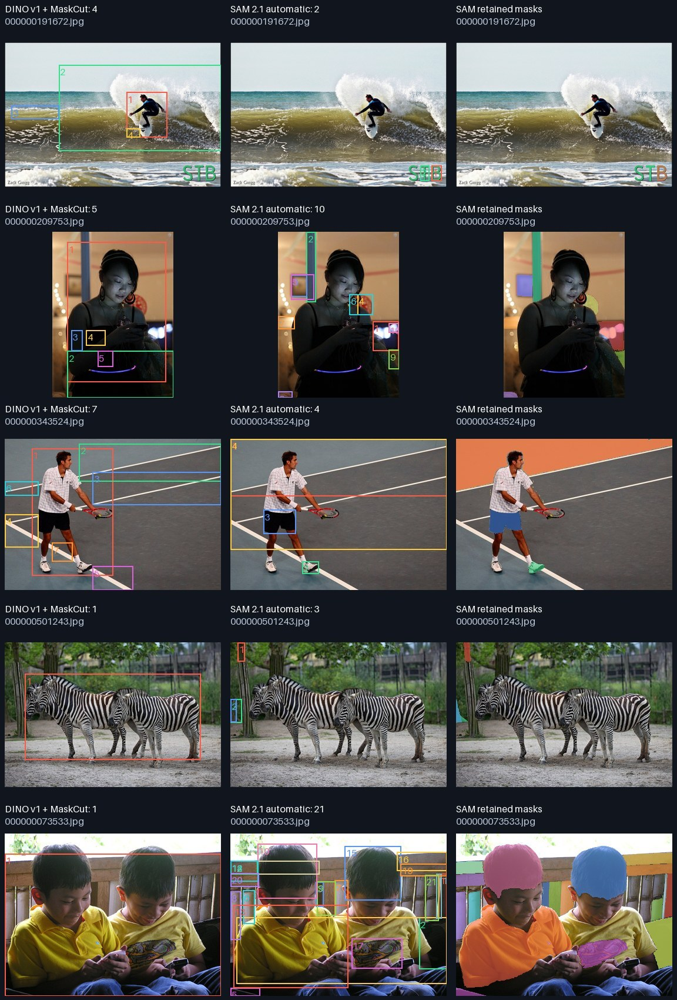

# Dense automatic-point confirmation

Companion to the [20-image comparison](../20261001T123557Z-sam-comparison-1953d6/review.md).
Same official SAM 2.1 Hiera-Tiny checkpoint, filters, CPU FP32 and four PyTorch
threads; only point-grid density changes from 16×16 to the official default 32×32.
`points_per_batch=16`, no crops/manual prompts/mask refinement/CUDA cleanup.
The five images were deliberately selected for diagnosis from the already examined
twenty; this is not an independent holdout or a random accuracy evaluation.

| Image | DINO boxes | SAM 16×16 | SAM 32×32 | Visual interpretation of dense result |
|---|---:|---:|---:|---|
| 000000191672, surfer | 4 | 0 | 2 | Only image watermark letters; no surfer |
| 000000209753, woman | 5 | 8 | 10 | Parts/background; no complete person |
| 000000343524, tennis | 7 | 2 | 4 | Court, shorts and shoe; no complete player |
| 000000501243, zebras | 1 | 0 | 3 | Background fragments; no individual zebras |
| 000000073533, children | 1 | 21 | 21 | Shirts, heads and bench; not two complete people |

All five runs completed. Mean service times: DINO 0.329 s/image, SAM 18.175 s/image.
For this same subset the sparse SAM mean is about 5 s/image; actual per-image timing
is in each JSON. No claim of GPU throughput or speed stability from these CPU runs.
The generic warning about the 16×16 preview in `summary.md` describes the CLI default;
**this run uses 32×32**, as confirmed by `sam.amg` and its command in `comparison.json`.



Increasing point density alone did not resolve complete-instance selection on
these examples at the chosen mask quality thresholds. This does not establish
that SAM cannot segment these objects with prompts, different filters, a larger
checkpoint or another proposal strategy. Those alternatives are untested here.
The current experiment also cannot measure general detection accuracy without
independent scored ground truth.

The data directory `data/sam-check5` contains symlinks to the original images under
`data/coco-visual-20`, with the five filenames listed above; no image copies or
annotations were created. Input SHA256 values are in `comparison.json`.

Reproduce with these files present:

```bash
./solo compare-sam data/sam-check5 --limit 5 --points-per-side 32
```
