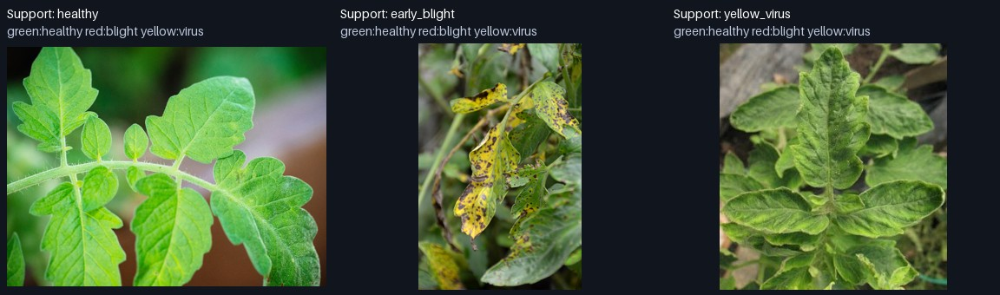
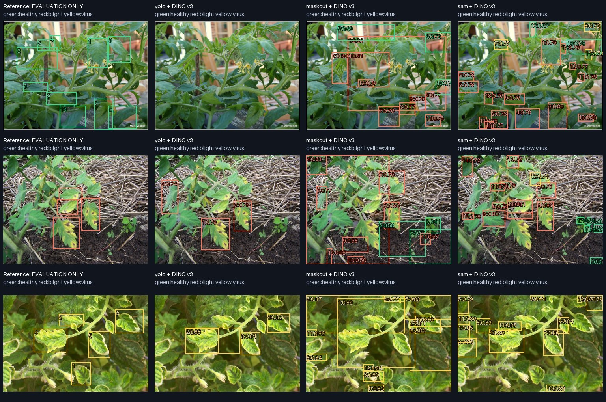

# 토마토 상태 few-shot 실제 샘플 비교

실행: `./solo crop-demo` · 측정 코드: `3456c86ac530ca9b6271870f51ffbc640b8a5485`

결론: 이 설정은 아직 농작물 잎 상태 인식에 충분하지 않습니다. 일반 COCO YOLO에
DINO 특징 비교를 붙이는 것만으로 잎 후보 누락이 해결되지 않았습니다. DINO v2/v3는
v1보다 상태 비교 결과가 좋았지만, 건강한 잎의 오분류가 크게 남았습니다.

## 데이터와 절차

- [PlantDoc](https://github.com/pratikkayal/PlantDoc-Dataset) cropped train에서 건강,
  Early blight, Yellow virus 각 1장을 support로 사용했습니다.
- [원본 탐지 데이터](https://github.com/pratikkayal/PlantDoc-Object-Detection-Dataset)
  TEST에서 상태별 3장, 총 9장을 query로 사용했습니다. 참조 잎 박스는 총 43개입니다.
- 실외·화분·재배 배경이 있는 사진을 모델 결과를 보기 전에 골랐습니다. 농장 전체를
  찍은 광각 사진이나 특정 농장에서 독립적으로 수집한 검증 세트는 아닙니다.
- 출처, 고정 revision, 파일 SHA256은 `results.json`의 manifest와
  `configs/crop-demo.json`에 있습니다. 저자: Singh, Jain, Jain, Kayal, Kumawat,
  Batra (2020), 공개 저장소 라이선스 CC BY 4.0. 원본 자료에서 가져온 축소·주석 이미지입니다.
- support/query는 파일과 해시가 다르지만 식물 개체·촬영 세션의 완전한 독립성은
  검증하지 않았습니다. 데이터셋 상태 주석은 병해의 확진이 아닙니다.
- 각 query는 DINO 버전별로 한 번만 처리했습니다. 3 support + 9 query = 버전별 12 forward.
  support 전체 특징과 query 박스 안의 최종 patch 특징을 평균해 cosine으로 비교합니다.
- 모든 후보 생성 후 공개 참조 박스를 평가에만 읽었습니다. 후보와 참조 박스는
  IoU ≥ 0.5로 일대일 대응하며 상태 이름은 박스 대응에 사용하지 않습니다.
- 학습된 SOLO 전용 YOLO가 로컬에 없어 공식 COCO YOLO11n을 대조군으로 사용했습니다.
  클래스 이름을 무시했지만 COCO에 없는 객체까지 찾도록 재학습한 모델은 아닙니다.

## 위치를 찾고 상태까지 맞히는 결과

같은 후보 박스를 v1/v2/v3 특징으로 각각 분류했습니다. 분모는 모두 43개 참조 잎입니다.

| 후보 생성 | 후보 수 | 위치 일치 | v1 위치+상태 | v2 위치+상태 | v3 위치+상태 |
|---|---:|---:|---:|---:|---:|
| DINO v1 MaskCut | 69 | 5/43 | 1/43 | 5/43 | 5/43 |
| COCO YOLO11n | 20 | 9/43 | 6/43 | 9/43 | 9/43 |
| SAM 2.1 Tiny 자동 | 105 | 12/43 | 4/43 | 7/43 | 7/43 |

후보 개수가 많다고 개별 잎을 잘 찾는 것은 아닙니다. SAM은 위치 recall이 가장 높지만
이 설정에서는 27.9%에 그쳤습니다. YOLO+v2/v3의 위치·상태 동시 recall도 20.9%입니다.
참조 주석에 빠진 잎이 있을 수 있어 미대응 후보를 모두 오탐으로 계산하지 않았습니다.

## 잎 위치를 이미 안다고 가정한 별도 진단

이 표만 참조 박스에서 직접 특징을 추출합니다. 실제 객체 탐지 성능과 구분해야 합니다.

| DINO 특징 | 건강 | Early blight | Yellow virus | 전체 | 클래스별 평균 |
|---|---:|---:|---:|---:|---:|
| v1 | 1/12 | 1/6 | 24/25 | 60.5% | 40.3% |
| v2 | 2/12 | 6/6 | 25/25 | 76.7% | 72.2% |
| v3 | 3/12 | 6/6 | 25/25 | 79.1% | 75.0% |

v3의 79.1%를 현장 정확도로 해석할 수 없습니다. 건강한 잎은 위치를 알려줘도 25%만
맞혔고 클래스 수가 불균형합니다. v3와 v2는 단 한 잎 차이여서 일반적인 우열도
결론 내릴 수 없습니다. 세 상태 중 하나를 무조건 고르는 실험이며 unknown/background
거부는 보정하거나 검증하지 않았습니다. cosine 숫자는 확률이나 정확도가 아닙니다.

## 눈으로 보는 실패와 성공

아래 행은 건강 / Early blight / Yellow virus이며, 열은 참조 / YOLO / MaskCut / SAM입니다.
세 예측 열 모두 DINO v3로 상태를 비교했습니다. 초록=건강, 빨강=blight, 노랑=virus.

- 건강한 잎이 많은 첫 사진에서 YOLO 후보는 0개입니다. MaskCut/SAM은 여러 영역을
  만들지만 건강한 잎을 blight로 분류하는 문제가 보입니다.
- 두 번째 사진에서는 YOLO가 병든 잎 몇 개를 분리하고 v3가 상태를 맞히지만 누락도 있습니다.
- 세 번째 사진에서는 YOLO가 비교적 적절한 잎 후보를 만들고 virus 예시와 연결합니다.
  MaskCut/SAM에는 큰 영역·작은 조각·중복처럼 보이는 후보가 남습니다.
- `summary.md`에 v1 전체 9장, `v2-*.jpg`, `v3-*.jpg`에 각 버전 전체 9장이 있습니다.
  좋은 결과만 선택해 전체 수치를 계산하지 않았습니다.

## 다음 결정

YOLO 후보 + frozen DINO ROI 매칭 구조는 유지하되, 일반 COCO YOLO를 농작물 잎 detector로
간주하지 않습니다. 다음 검증의 우선순위는 잎 후보 recall과 개체 분리입니다. SAM 자동
마스크도 검증 없이 전부 학습 라벨로 쓰기에는 부족했습니다. 상태 비교는 v2/v3를 후보로
두고 support 배경 제거·더 다양한 support를 독립 평가 자료에서 비교해야 합니다.
본 실험만으로 전체 pseudo-label 생성기를 교체하거나 대규모 재학습을 시작하지 않습니다.

CPU FP32 탐색 실행이며 A5000 처리량 benchmark가 아닙니다. SAM Tiny 1024, 16×16 자동
point grid, DINO ViT-S 448 설정만 비교했습니다. 모델 크기·해상도·SAM 프롬프트에 대한
최적화 결과는 아닙니다. 모델 출력은 원본 실행 그대로이며, 저장 후 summary 표 순서만
수정하고 이 해설과 focus 합성 그림을 추가했습니다.
