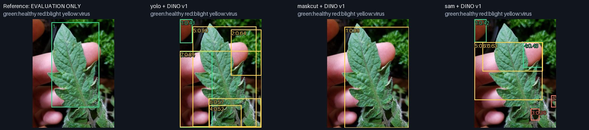
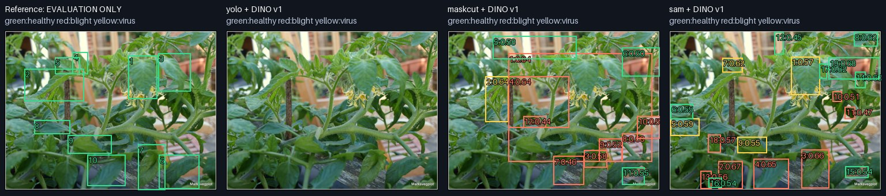
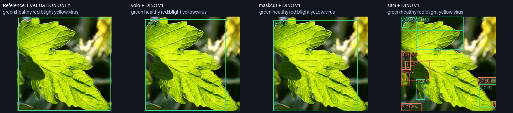
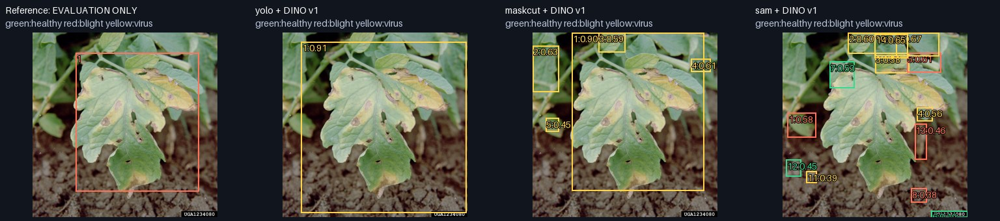
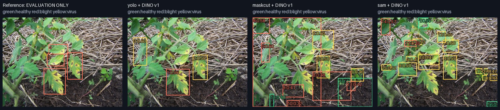
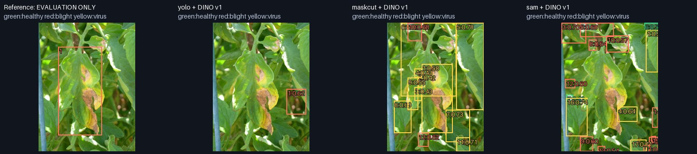
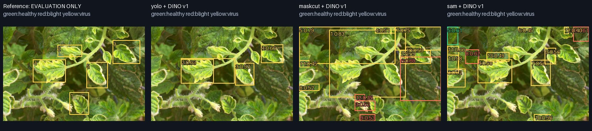
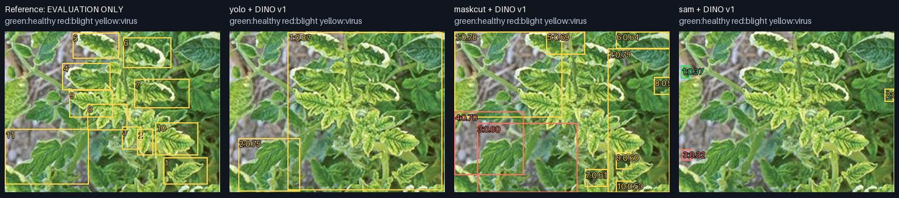
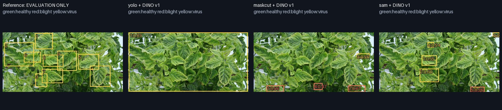

# Crop few-shot diagnostic

Status: complete
Source: {'commit_sha': '3456c86ac530ca9b6271870f51ffbc640b8a5485', 'branch': 'codex/milestone-1', 'dirty': False}
Command: `./solo crop-demo`

- 3 support images, one per class; 9 visually selected natural-background query images.
- Dataset labels are not independently verified agronomic diagnoses.
- Queries have garden/pot/field-like backgrounds, not a verified commercial-field dataset.
- COCO-pretrained YOLO11n is a control, NOT the untrained/unavailable SOLO object detector.
- YOLO class labels are ignored, which does not make its proposals class agnostic.
- Reference boxes are evaluation-only, including the marked oracle-ROI diagnostic.
- Known-three-class top1 matching; no calibrated unknown/background rejection.
- Annotation incompleteness means unmatched proposals are not all proven false positives.
- No weights or feature-fusion layers are trained. Query DINO forward only once/model.

| Features / proposals | Localized / leaves | Correct state + location |
|---|---:|---:|
| v1/maskcut | 5/43 | 1/43 |
| v1/yolo | 9/43 | 6/43 |
| v1/sam | 12/43 | 4/43 |
| v1/reference_roi | 43/43 | 26/43 |
| v2/maskcut | 5/43 | 5/43 |
| v2/yolo | 9/43 | 9/43 |
| v2/sam | 12/43 | 7/43 |
| v2/reference_roi | 43/43 | 33/43 |
| v3/maskcut | 5/43 | 5/43 |
| v3/yolo | 9/43 | 9/43 |
| v3/sam | 12/43 | 7/43 |
| v3/reference_roi | 43/43 | 34/43 |

| Reference ROI diagnostic | Healthy | Early blight | Yellow virus |
|---|---:|---:|---:|
| v1 | 1/12 | 1/6 | 24/25 |
| v2 | 2/12 | 6/6 | 25/25 |
| v3 | 3/12 | 6/6 | 25/25 |

Reference ROI rows assume known leaf boxes: matching diagnostic only, NOT end-to-end detection performance. Known-class argmax; no unknown gate.

