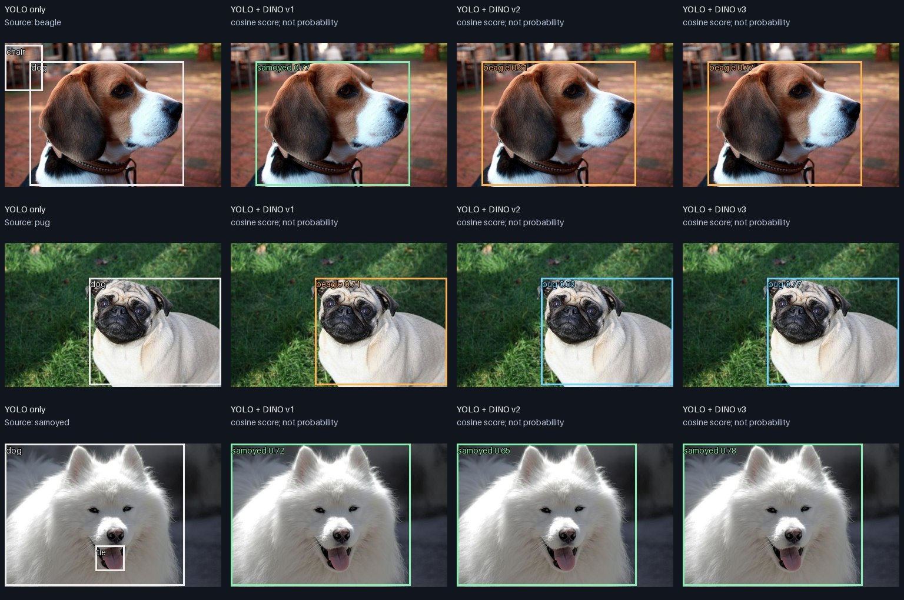
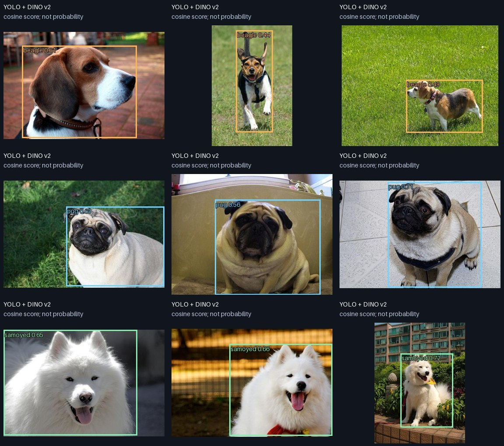

# 일상 물체 예시: 개를 찾고 예시 사진의 종류로 구분하기

실행 명령: `./solo pet-demo`  
측정 코드: `c7a68be99d446bc817a9c36199094d8a0c965192` (clean checkout)

농작물 잎 대신 YOLO가 기본적으로 학습한 **개**를 대상으로 바꿨습니다.
YOLO는 위치와 `dog`를 예측하고, frozen DINO의 ROI 특징을 예시와 비교해
**비글 / 퍼그 / 사모예드** 중 하나를 붙입니다. 모델을 추가 학습하지 않았습니다.

## 예시와 테스트 자료

[Oxford-IIIT Pet 공식 자료](https://www.robots.ox.ac.uk/~vgg/data/pets/)의 세 품종을
사용했습니다. 저자: Omkar M. Parkhi, Andrea Vedaldi, Andrew Zisserman, C. V. Jawahar,
*Cats and Dogs*, CVPR 2012. CC BY-SA 4.0이며 원본 저작권은 사진 소유자에게 있습니다.
이 보고서의 축소·주석·합성 그림도 CC BY-SA 4.0으로 공유합니다.

다운로드는 [timm 미러](https://huggingface.co/datasets/timm/oxford-iiit-pet)의 고정 revision
`089695c834a7deb60505b7cc506672db1c31a6aa`를 사용했습니다. `configs/pet-demo.json`과
`results.json`에 원본 이미지 ID, split, row index, 이미지 SHA256을 기록했습니다.
세 품종 각각 train의 첫 행을 support, test의 첫 세 행을 query로 선택했습니다.
모델 추론 전에 선택을 고정했으며 실패 사진을 제외하지 않았습니다.

## 전체 자연 사진 9장 결과

| 처리 | 개 후보가 나온 사진 | 이미지의 종류를 맞힌 대표 개 후보 |
|---|---:|---:|
| COCO YOLO11n 단독 | 9/9 | 품종 출력 없음: 모두 `dog` |
| 같은 YOLO 박스 + DINO v1 | 9/9 | 3/9 |
| 같은 YOLO 박스 + DINO v2 | 9/9 | 9/9 |
| 같은 YOLO 박스 + DINO v3 | 9/9 | 8/9 |

품종별 v1은 비글 0/3, 퍼그 0/3, 사모예드 3/3입니다. v2는 각 3/3,
v3는 비글 2/3, 퍼그 3/3, 사모예드 3/3입니다. v3는 달리는 비글 `beagle_30`을
퍼그로 분류했습니다. 박스에 쓴 수치는 cosine 유사도이며 확률/정확도가 아닙니다.

아래는 **각 품종 첫 테스트 사진**입니다. 왼쪽부터 YOLO만 / +v1 / +v2 / +v3입니다.

v2의 전체 9장입니다. 각 행은 비글 / 퍼그 / 사모예드이며 포즈·배경이 다른 사진입니다.

## 여러 후보를 한 번의 DINO 실행으로 비교하는 추가 진단

각 품종 첫 테스트 사진을 나란히 붙인 **합성 collage**입니다. 실제 한 장면에서
함께 촬영한 사진이 아니며, 위 자연 사진 9장의 수치에도 넣지 않았습니다.
각 모델에 전체 collage를 한 번 입력하고 YOLO의 세 dog 박스에서 특징을 pooling했습니다.

시각적으로 왼쪽 비글 / 가운데 퍼그 / 오른쪽 사모예드에 대응합니다.
v2는 세 종류를 모두 맞혔고, v3는 가운데 퍼그를 사모예드로 분류했습니다.
v1은 이 입력에서는 세 종류를 모두 틀렸습니다. 원본 세 사진은 유지하고 배치만 바꿨지만
448×448 리사이즈에 따른 왜곡·객체 크기·주변 문맥 변화가 있으므로, 이 추가 그림은
자연스러운 다중 개체/가림 상황의 검증으로 해석하지 않습니다.

## 설정과 해석

- 공식 COCO YOLO11n, 640 입력, confidence 0.25, NMS IoU 0.7. 먼저 모든 클래스를
  예측한 뒤 `dog` 후보만 품종 매칭합니다. 의자·넥타이 등 다른 예측은 원본 YOLO 열에
  보존했습니다. 범용 class-agnostic detector나 학습된 SOLO 전용 YOLO의 결과가 아닙니다.
- DINO ViT-S v1/v2/v3, 448 입력, frozen CPU FP32, 최종 LayerNorm patch 특징.
  support 전체 특징을 평균하고 정규화합니다. query는 동일한 YOLO 박스에서 fractional
  mean ROI pooling 후 cosine argmax로 비교합니다. 이름 문자열을 모델 입력으로 쓰지 않습니다.
- backbone별 13 forward: support 3 + query 9 + collage 1. 후보마다 DINO를 다시 돌리지 않습니다.
- 평가는 이미지별 가장 confidence가 높은 dog 후보의 예측 종류를 이미지 주석과
  비교했습니다. 이번 자연 사진들에서는 각 사진에 dog 후보가 하나씩 나왔습니다.
  정답 박스 IoU를 계산하지 않았으므로 9/9 후보 존재를 검출 recall/mAP로 부르지 않습니다.
- 외형이 비교적 뚜렷한 세 종류, 예시 1장씩, 테스트 9장인 소규모 실험입니다. 9/9는
  일반적인 100% 성능을 의미하지 않습니다. 세 품종 밖의 개를 unknown으로 거부하는
  기능이나 같은 품종 안에서 개체 신원을 구분하는 기능은 검증하지 않았습니다.
- train/test가 서로 다른 파일인 것은 확인했지만 같은 동물 개체/촬영 세션의 독립성,
  DINO 사전학습 자료와의 중복은 검증하지 않았습니다.

이 예시는 **YOLO가 위치를 확보한 뒤 DINO가 더 세부적인 구분을 담당하는 구조**가
작동할 수 있음을 보여줍니다. 현재 ROI 평균 특징 방식에서는 v2를 다음 비교의 우선
후보로 삼을 근거가 생겼습니다. v1의 MaskCut 박스 생성 적합성과 few-shot 특징 비교
적합성은 별도로 판단해야 합니다. 이 작은 결과만으로 production backbone을 교체하거나
v2의 일반적인 우위를 확정하지 않습니다.

명령·샘플·가중치·캐시는 레포 내부에서 관리합니다. 신규 다운로드 경로를 별도로
확인했고 코드 검사는 통과했으며 테스트 79개가 통과했습니다. 실패와 성공 전체 원시
예측은 `results.json`, 개별 그림은 `summary.md`에서 확인할 수 있습니다.
