# Everyday pet few-shot demo

Status: complete
Source: {'commit_sha': 'c7a68be99d446bc817a9c36199094d8a0c965192', 'branch': 'codex/milestone-1', 'dirty': False}
Command: `./solo pet-demo`

- COCO-pretrained YOLO11n control, not a trained SOLO class-agnostic detector.
- YOLO runs all classes; breed matching explicitly routes only its dog predictions.
- Three visually distinct breeds, one support and three test photos per breed.
- Breed recognition, NOT identity recognition of the same individual dog.
- No reference boxes used; candidate presence is NOT ground-truth localization recall.
- No verification of train/test animal identity or pretraining data overlap.
- Known-three-class matching: unknown dogs/background rejection untested.
- Synthetic collage is an extra diagnostic, excluded from the nine-photo metrics.
- CPU demonstration only; not a throughput or field benchmark.

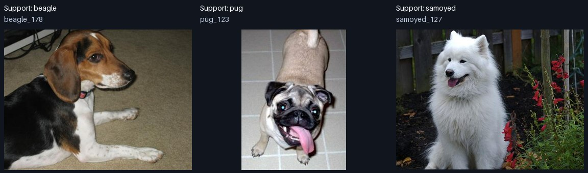

| DINO | Photos with dog candidate | Top dog correct breed |
|---|---:|---:|
| v1 | 9/9 | 3/9 |
| v2 | 9/9 | 9/9 |
| v3 | 9/9 | 8/9 |

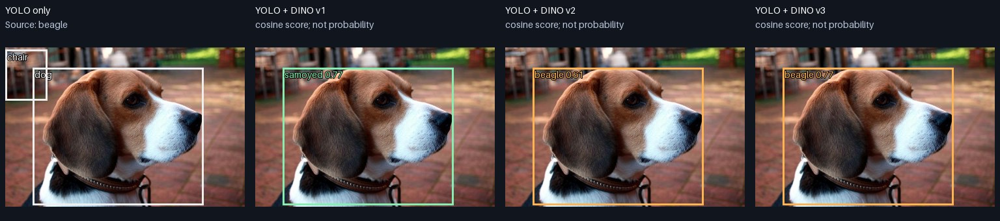

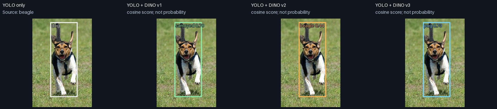

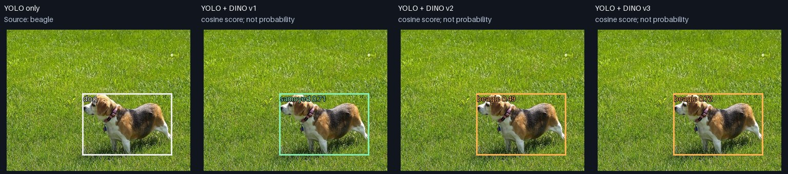

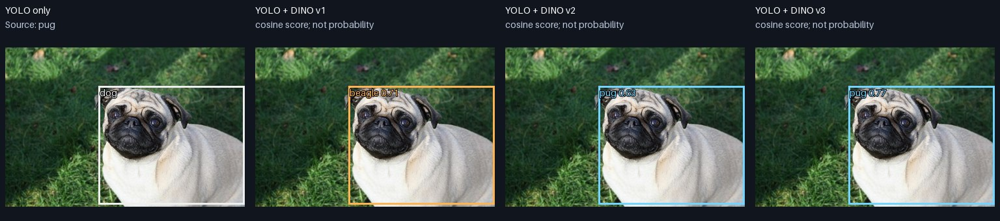

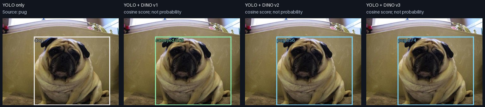

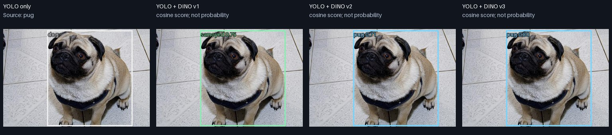

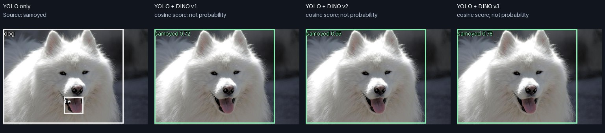

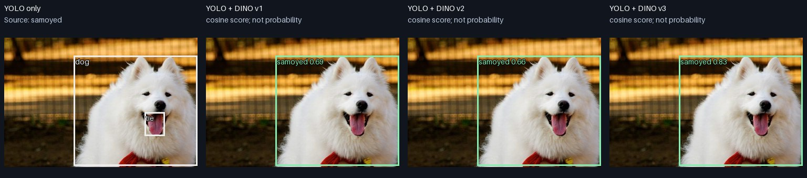

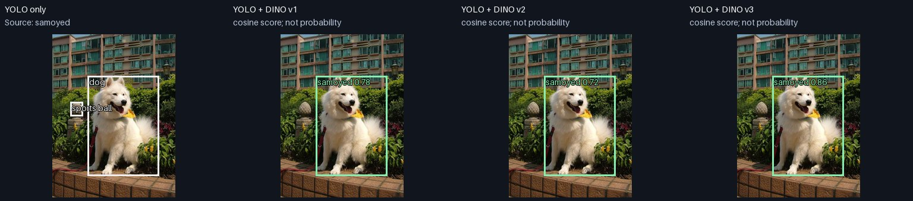

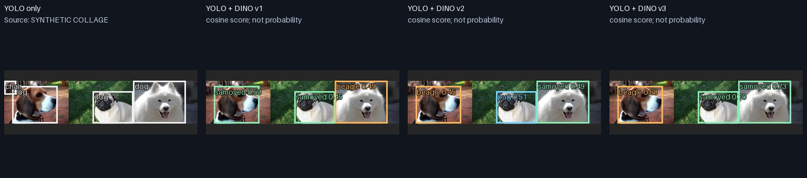
